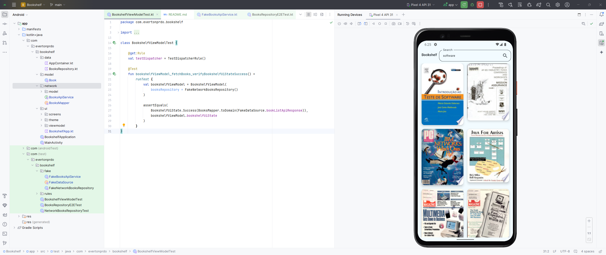

# Project: Create a Bookshelf App

To practice the concepts you learned in this unit, including coroutines,
Retrofit, and Gson, you're going to build an app on your own that displays a
list of books with images from the Google Books API.

The app is expected to do the following:

- [x] Make a request to the Google Books API using Retrofit.
- [x] Parse the response using Gson.
- [x] Display asynchronously downloaded images of the books along with their
  titles in a vertical grid.
- [x] Implement best practices, separating the UI and data layer, by using a
  repository.
- [x] Write tests for code that requires the network service, using dependency
  injection.

link: https://developer.android.com/codelabs/basic-android-kotlin-compose-bookshelf