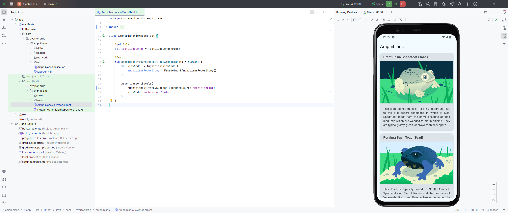

# Amphibians app

In this practice set, you will build an app to display a list of amphibians,
along with their details and image. The data is retrieved from the internet by
making a network request and contains each amphibian's name, type, description,
and image URL.

The amphibian JSON data is hosted
at https://android-kotlin-fun-mars-server.appspot.com/amphibians.