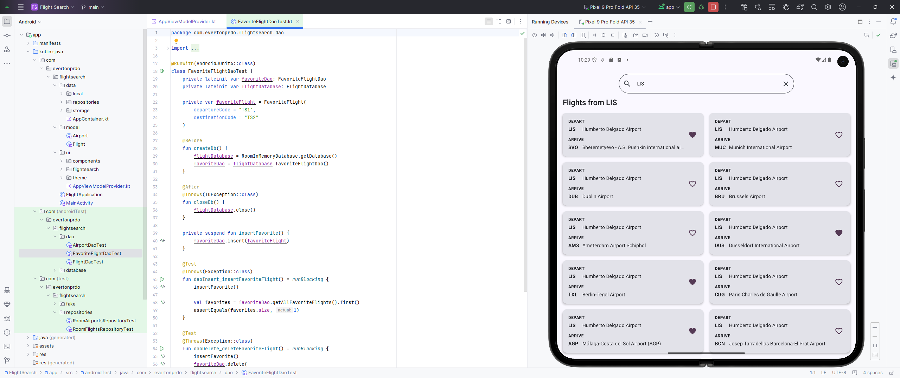
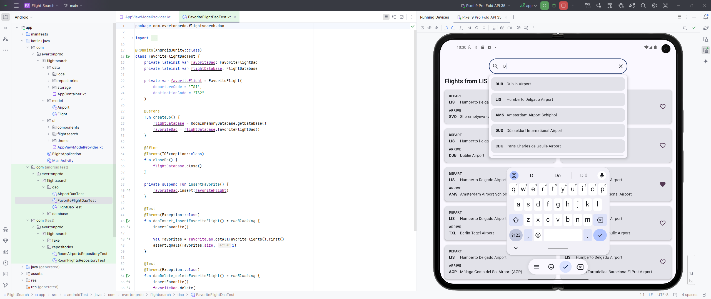
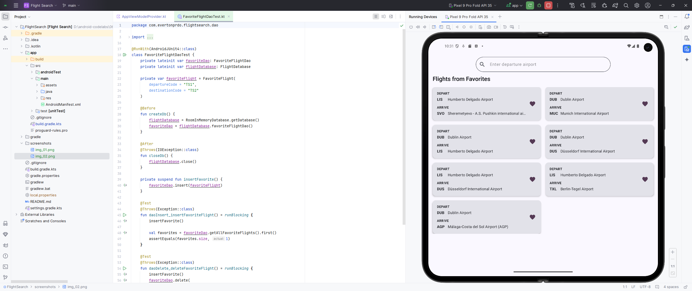

# Flight Search

In this project, you'll build the Flight Search app in which users enter an airport and can view a list of destinations using that airport as a departure. This project gives you the opportunity to practice your skills with SQL, Room, and DataStore by offering you a set of app requirements that you must fulfill. In particular, you need the Flight Search app to meet the following requirements:

- [x] Provide a text field for the user to enter an airport name or International Air Transport Association (IATA) airport identifier.
- [x] Query the database to provide autocomplete suggestions as the user types.
- [x] When the user chooses a suggestion, generate a list of available flights from that airport, including the IATA identifier and airport name to other airports in the database.
- [x] Let the user save favorite individual routes.
- [x] When no search query is entered, display all the user-selected favorite routes in a list.
- [x] Save the search text with Preferences DataStore. When the user reopens the app, the search text, if any, needs to prepopulate the text field with appropriate results from the database.

prepopulated database: https://github.com/google-developer-training/android-basics-kotlin-sql-basics-app/tree/project
codelab: https://developer.android.com/codelabs/basic-android-kotlin-compose-flight-search